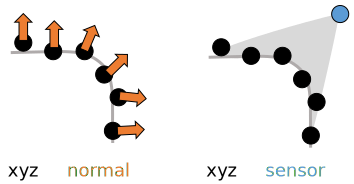
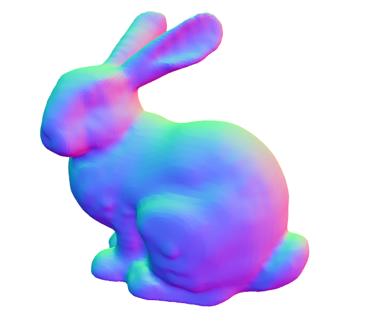
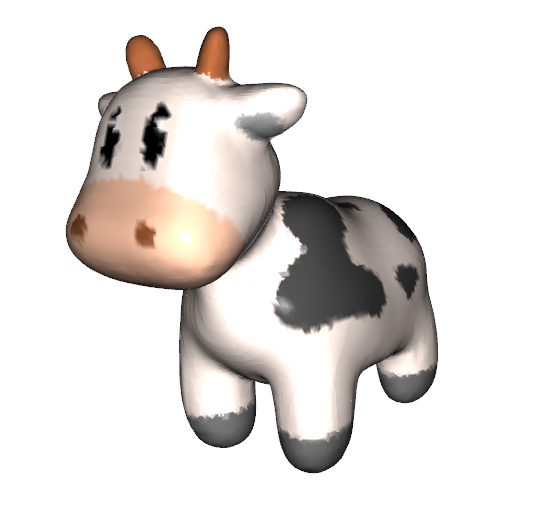
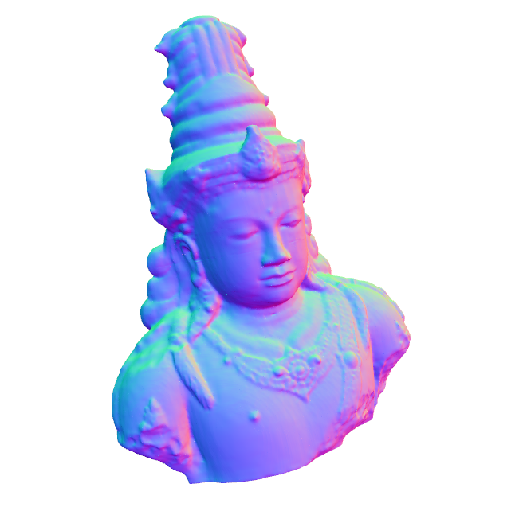
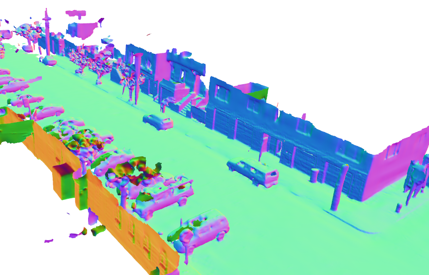
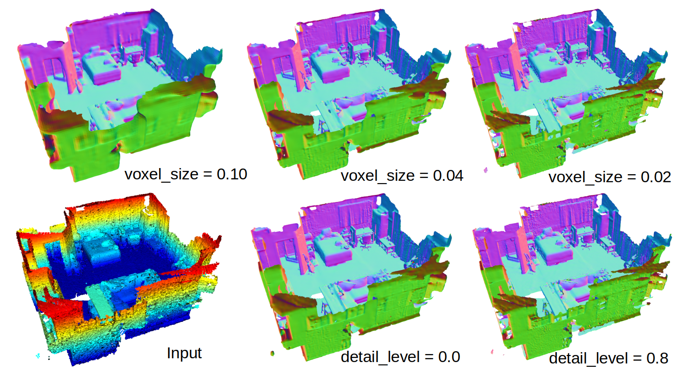

# NKSR Package Documentation

## Pre-built wheels

Our reconstruction algorithm is provided as an installable python package. **If you have already followed the README and set up the conda environment, NO additional installation steps are required.**
If you want to install the `nksr` package into other python environments, we provide the following pre-built wheels. Note that only Linux is supported for now (Ubuntu >= 20.04 recommended).


|                | Python | `cu113` | `cu116` | `cu117` | `cu118` |
|----------------|---------|---------|---------|---------|---------|
| PyTorch 2.0.0  | 3.8 - 3.11 |       |       | ✅      | ✅      |
| PyTorch 1.13.0 | 3.7 - 3.11 |       | ✅     | ✅      |       |
| PyTorch 1.12.0 | 3.7 - 3.10 | ✅ | ✅ |  |  |

Use the following command to install `nksr`.
```bash
pip install -U nksr -f https://nksr.huangjh.tech/whl/torch-${TORCH_VERSION}+${CUDA_VERSION}.html
```

An example combination would be `TORCH_VERSION=2.0.0` and `CUDA_VERSION=cu118`.

## Data preparation

NKSR takes point cloud as input. A point cloud is an array of 3D points that is internally represented as an Nx3 array, with each row storing the position (`xyz`) of the points.
Additionally, each point could have orientation-related information, such as `normal`, or `sensor` position, as shown in the figure below.



NKSR supports reconstructing from oriented point cloud, with either `xyz` + `normal`, or `xyz` + `sensor`. All variables here should be Nx3 array.
The point positions could be easily obtained from the output of your 3D sensor. To estimate the normal, you will need to do perform local PCA. This is supported in many softwares such as MeshLab or Open3D.
An easier to acquire source of information is the sensor position, which refers to the 3D location of the sensor that captures this point.
Having sensor location could effectively disambiguate normal orientations and achieve globally consistent reconstructions.

## Recipes

Here are a collection of example usages of NKSR. Feel free to dig into the package documentation to figure out more interesting combinations.

### From Oriented Point Clouds

```python
import nksr
import torch

device = torch.device("cuda:0")
reconstructor = nksr.Reconstructor(device)

# Note that input_xyz and input_normal are torch tensors of shape [N, 3] and [N, 3] respectively.
field = reconstructor.reconstruct(input_xyz, input_normal)
mesh = field.extract_dual_mesh()

# Visualizing 
#   (Use whatever other libraries you like, here mesh.v is Vx3 array and mesh.f is Tx3 triangle index array)
from pycg import vis
vis.show_3d([vis.mesh(mesh.v, mesh.f)])
```

Please see live example by running `python examples/recons_simple.py`.



### Reconstruct colored mesh

This example shows how to reconstruct a colored mesh with per-vertex color.

```python
import nksr
import torch

device = torch.device("cuda:0")
reconstructor = nksr.Reconstructor(device)

# Note that input_xyz and input_normal are torch tensors of shape [N, 3] and [N, 3] respectively.
field = reconstructor.reconstruct(input_xyz, input_normal)
# input_color is also a tensor of shape [N, 3]
field.set_texture_field(nksr.fields.PCNNField(input_xyz, input_color))
# Increase the dual mesh's resolution.
mesh = field.extract_dual_mesh(mise_iter=2)

# Visualizing (mesh.c is Vx3 array for per-vertex color)
from pycg import vis
vis.show_3d([vis.mesh(mesh.v, mesh.f, color=mesh.c)])
```

Please see live example by running `python examples/recons_colored_mesh.py`.



### Reconstruct in Chunks

Suppose that you have a large point cloud and it is hard to fit the full cloud into the memory.
In this case, you can reconstruct the point cloud in chunks.

In the meantime, this code also demonstrates how to estimate normals automatically from input sensor positions.

```python
import nksr
import torch

device = torch.device("cuda:0")
reconstructor = nksr.Reconstructor(device)
reconstructor.chunk_tmp_device = torch.device("cpu")

# Note that input_xyz and input_sensor are torch tensors of shape [N, 3] and [N, 3] respectively.
# You have to manually specify the size of the chunk.
# To estimate normal, specify the kNN and search radius for the normal estimator
field = reconstructor.reconstruct(
    input_xyz, sensor=input_sensor,
    chunk_size=chunk_size,
    preprocess_fn=nksr.get_estimate_normal_preprocess_fn(64, 85.0)
)
mesh = field.extract_dual_mesh()

# Visualizing
from pycg import vis
vis.show_3d([vis.mesh(mesh.v, mesh.f)])
```

Please see live example by running `python examples/recons_by_chunk.py`.



Another example that reconstructs a Waymo sequence is at `python examples/recons_waymo.py`.



### Dealing with Noise

Real-world point cloud could contain different levels of noise, and it is important to tune the hyperparameters that balance noise and details.
In NKSR this is achieved via two arguments of the `reconstruct` function, namely `detail_level` and `voxel_size`.
The two arguments should be used exclusively. Specifically they have the following effects:

1. `detail_level` is by default 0, and you can tune it from 0.0 to 1.0, where 0.0 contains the least detail but may be more robust towards noise, and 1.0 has the most details but could overfit to noise and leads to memory overflow.
2. `voxel_size` is by default `None`, referring to the voxel size of the finest level in the sparse voxel hierarchy. The size should be roughly the standard deviation of your noise level. If this is provided, then `detail_level` will be ignored.

A visualization of these parameters can be seen below. The example ScanNet point cloud can be downloaded by calling `load_scannet_example()` in `examples/common.py`.



### Running on a device with Small Memory

NKSR supports all operations on CPU, hence if you don't have GPU or your GPU only has small memory, there are two solutions:

1. Run the entire pipeline on CPU. This could be achieved by changing the device from `cuda:0` to `cpu`.
2. Run the reconstruction in chunk mode (where reconstructing each individual chunk will take a small amount of GPU memory), and extract the final mesh on CPU. Below is an example:

```python
device = torch.device("cuda:0")
reconstructor = nksr.Reconstructor(device)
reconstructor.chunk_tmp_device = torch.device("cpu")

input_xyz = ...
input_sensor = ...

field = reconstructor.reconstruct(
    input_xyz, sensor=input_sensor, ...,
    chunk_size=50.0,        # This could be smaller
    preprocess_fn=nksr.get_estimate_normal_preprocess_fn(64, 85.0)
)

# Put everything onto CPU.
field.to_("cpu")
reconstructor.network.to("cpu")

# [WARNING] Slow operation...
mesh = field.extract_dual_mesh(mise_iter=1)
```

To prevent CUDA OOM, one last resort is to add `PYTORCH_NO_CUDA_MEMORY_CACHING=1` as environment variable!
