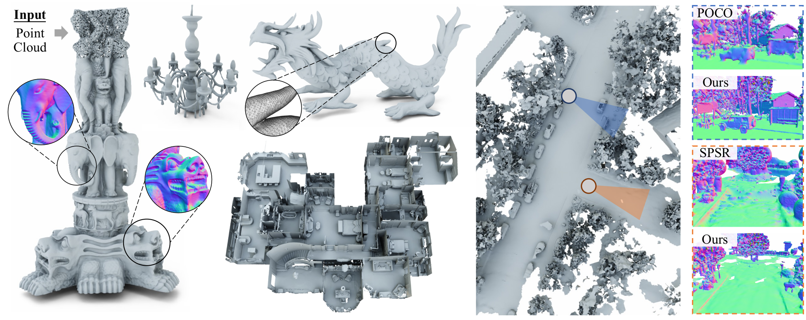

# Neural Kernel Surface Reconstruction



[](https://badge.fury.io/py/nksr)

**Neural Kernel Surface Reconstruction**<br>
[Jiahui Huang](https://huangjh-pub.github.io/),
[Zan Gojcic](https://zgojcic.github.io/),
[Matan Atzmon](https://matanatz.github.io/),
[Or Litany](https://orlitany.github.io/), 
[Sanja Fidler](https://www.cs.toronto.edu/~fidler/),
[Francis Williams](https://www.fwilliams.info/) <br>
**[Paper](https://huangjh-pub.github.io/publication/nksr/paper.pdf), [Project Page](https://research.nvidia.com/labs/toronto-ai/NKSR/)**

Abstract: *We present a novel method for reconstructing a 3D implicit surface from a large-scale, sparse, and noisy point cloud. 
Our approach builds upon the recently introduced [Neural Kernel Fields (NKF)](https://nv-tlabs.github.io/nkf/) representation. 
It enjoys similar generalization capabilities to NKF, while simultaneously addressing its main limitations: 
(a) We can scale to large scenes through compactly supported kernel functions, which enable the use of memory-efficient sparse linear solvers. 
(b) We are robust to noise, through a gradient fitting solve. 
(c) We minimize training requirements, enabling us to learn from any dataset of dense oriented points, and even mix training data consisting of objects and scenes at different scales. 
Our method is capable of reconstructing millions of points in a few seconds, and handling very large scenes in an out-of-core fashion. 
We achieve state-of-the-art results on reconstruction benchmarks consisting of single objects, indoor scenes, and outdoor scenes.*

For business inquiries, please visit our website and submit the form: [NVIDIA Research Licensing](https://www.nvidia.com/en-us/research/inquiries/)

## News

- 2023-06-02: Code released!

## Environment setup

We recommend using the latest Python and PyTorch to run our algorithm. To install all dependencies using [conda](https://www.anaconda.com/):

```bash
# Clone the repository
git clone git@github.com:nv-tlabs/nksr
cd nksr

# Create conda environment
conda env create

# Activate it
conda activate nksr
```

> For docker users, we suggest using a base image from [nvidia/cuda](https://hub.docker.com/r/nvidia/cuda) with tag `12.1.1-cudnn8-devel-ubuntu22.04`, and applying the above conda setup over it.

## Testing NKSR on your own data

We have tested our algorithm on multiple different spatial scales. It can reconstruct scenes spanning kilometers with millions of points+ on an RTX 3090 GPU.
To use our `kitchen-sink` model (released under CC-BY-SA 4.0 license), the following code snippet suffices:

```python
import torch
import nksr

bunny_geom = load_bunny_example()

input_xyz = torch.from_numpy(np.asarray(bunny_geom.points)).float().to(device)
input_normal = torch.from_numpy(np.asarray(bunny_geom.normals)).float().to(device)

reconstructor = nksr.Reconstructor(device)
field = reconstructor.reconstruct(input_xyz, input_normal, detail_level=1.0)
mesh = field.extract_dual_mesh(mise_iter=1)
```

We have prepared detailed instructions about data preparation and different example usages at [NKSR Documentation Page](NKSR-USAGE.md).

## Reproducing results from the paper

Our training and inference system is based on the [Zeus Deep Learning](ZEUS_DL.md) infrastructure, supporting both tensorboard and wandb (recommended) as loggers. To config Zeus, copy the default yaml file and modify the related paths:

```bash
cp configs/default/zeus.yaml zeus_config.yaml
```

Modify the contents of `zeus_config.yaml` as needed to include your `wandb` account name and checkpoint/test results save directory.

### Training

Data download links:
- ShapeNet: Data is available [here](https://s3.eu-central-1.amazonaws.com/avg-projects/occupancy_networks/data/dataset_small_v1.1.zip). Put the extracted `onet` folder under `../data/shapenet`.
- Points2Surf: Data is available [here](). We've used blensor to re-generate all the data following the original script in order to obtain input normals.
- CARLA: Data is available [here]().

> We are pending approval for the latter two datasets from the company. Stay tuned!

The main training script is `train.py`. We provide different config files for the different datasets we've benchmarked in our paper:
```bash
# ShapeNet small noise 1K input
python train.py configs/shapenet/train_1k_perfect.yaml
# ShapeNet medium noise 3K input
python train.py configs/shapenet/train_3k_noise.yaml
# ShapeNet big noise 3K input
python train.py configs/shapenet/train_3k_noiser.yaml
# Points2Surf dataset noisy input
python train.py configs/points2surf/train.yaml
# CARLA dataset
python train.py configs/carla/train.yaml
```

In addition, you can manually specify different training settings to obtain models that suit your needs. Common flags include:
- `--wname`: Additional experiment name to specify for wandb logger.
- `--voxel_size`: Size of the finest level of voxels.
- `--feature`: Additional feature to the encoder, `none` for nothing, `normal` (default) for normal input, `sensor` for sensor direction input.
- `--tree_depth`: Depth of the sparse feature hierarchy. Default is 4.

### Inference

You can either infer using your own trained models or our pre-trained checkpoints.

```bash
# From pre-trained checkpoints
python test.py configs/shapenet/train_3k_noise.yaml --url https://nksr.s3.ap-northeast-1.amazonaws.com/snet-n3k-wnormal.pth --exec udf.enabled=False
python test.py configs/points2surf/train.yaml --url https://nksr.s3.ap-northeast-1.amazonaws.com/p2s.pth --include configs/points2surf/data_abc_test.yaml
python test.py configs/carla/train.yaml --url https://nksr.s3.ap-northeast-1.amazonaws.com/carla.pth  --include configs/carla/data_no_patch.yaml

# From your own trained models
python test.py none --ckpt wdb:<WANDB_USER_NAME>/<WANDB_PROJECT>/<WANDB_RUN_ID>
```

Useful flags for `test.py` include:
- `-v` or `--visualize`: visualize the results during the test process.
- `--test_print_metrics`: print the metrics during testing.
- `--test_n_upsample`: level of geometric upsample. Recommended value is 4.

## License

Copyright &copy; 2023, NVIDIA Corporation & affiliates. All rights reserved.
This work is made available under the [Nvidia Source Code License](LICENSE.txt).

## Related Works

NKSR is highly based on the following existing works:

- Williams et al. 2021. [Neural Fields as Learnable Kernels for 3D Reconstruction](https://nv-tlabs.github.io/nkf/).
- Huang et al. 2022. [A Neural Galerkin solver for Accurate Surface Reconstruction](https://github.com/huangjh-pub/neural-galerkin).

## Citation

```bibtex
@inproceedings{huang2023nksr,
  title={Neural Kernel Surface Reconstruction},
  author={Huang, Jiahui and Gojcic, Zan and Atzmon, Matan and Litany, Or and Fidler, Sanja and Williams, Francis},
  booktitle={Proceedings of the IEEE/CVF Conference on Computer Vision and Pattern Recognition},
  pages={4369--4379},
  year={2023}
}
```
